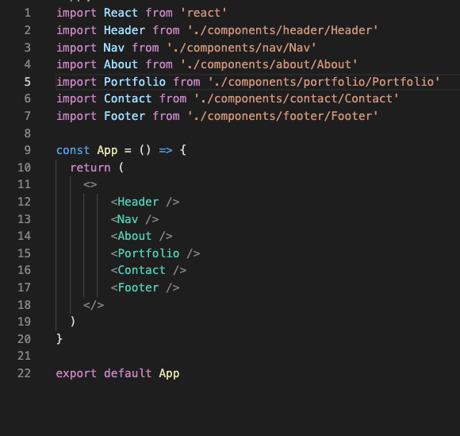

# React Portfolio
## USER STORY
AS AN employer looking for candidates with experience building single-page applications
I WANT to view a potential employee's deployed React portfolio of work samples
SO THAT I can assess whether they're a good candidate for an open position

## DESCRIPTION
My first React Project was to create my personal portfolio using my new React skills. This application is deployed on Heroku

## TABLE OF CONTENTS
- [INSTALLATION](#installation)
- [DESCRIPTION](#description)
- [LICENSE](#license)
- [QUESTIONS](#questions)

## INSTALLATION

    
## DESCRIPTION
Application has a single Header component that appears on multiple pages, with a Navigation component within it that’s used to conditionally render About Me, Portfolio, Contact and Resume sections.

    
## LICENSE

The license included for the project is under MIT License

## CHALLENGES FACED
Being able to upload all the media files into the Readme file

## FUTURE DEVELOPMENTS
Not much beside being somehow comfortable creating a project as such.

## QUESTIONS
If you have any further questions about this module or improvement ideas, please feel free to connect on either GitHub or LinkedIn, or email me at:
* GitHub: https://github.com/Mugisha27
* LinkedIn: https://www.linkedin.com/in/chris-mugisha-b7120413b/
* E-Mail: mondclear@gmail.com
